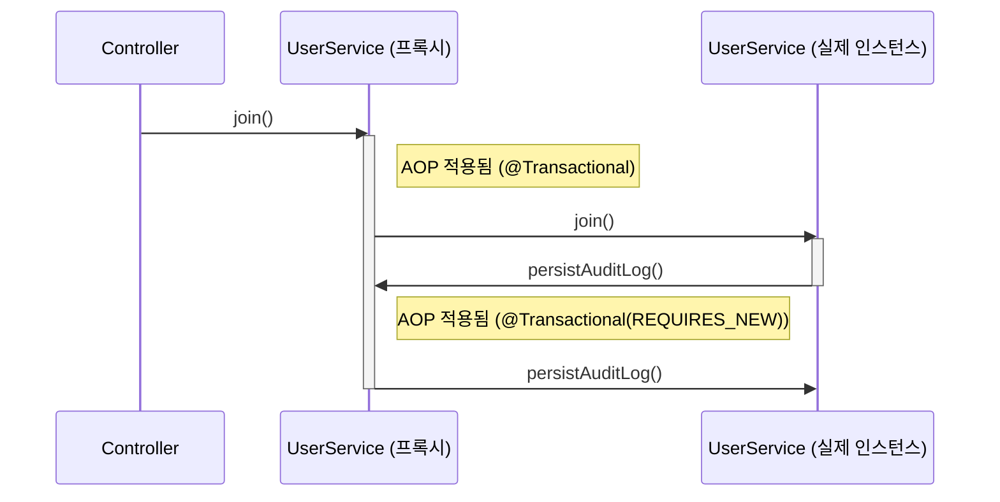
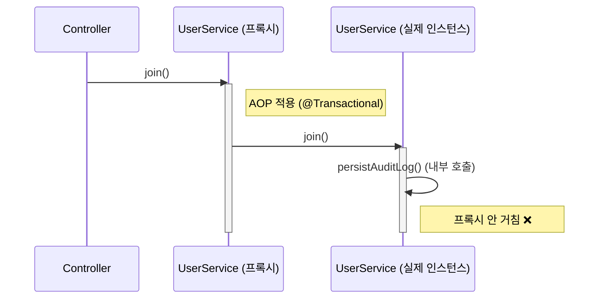
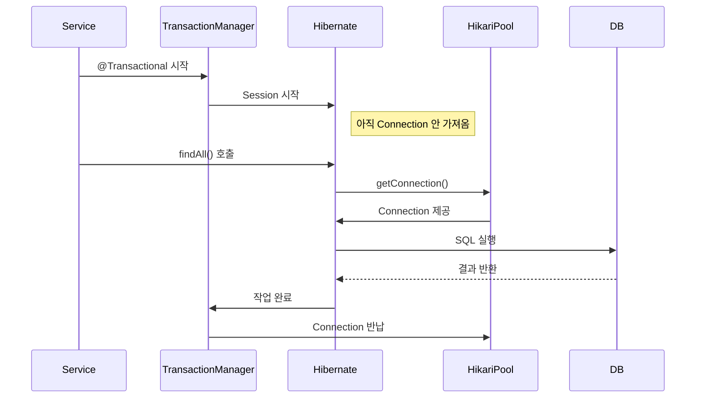

# @Transactional 기록

### Transactional 로그 분석
```bash
Found thread-bound EntityManager [SessionImpl(1481140994<open>)] for JPA transaction
```
- 현재 스레드에 이미 바인딩된 `EntityManager`가 있다는 의미.
- 이는 Spring이 관리하는 `EntityManager`이며, 이미 스레드 로컬에 존재하고 있어 재사용.
- 보통 `OpenEntityManagerInViewFilter` 혹은 `OpenEntityManagerInViewInterceptor`에 의해 바인딩된 것일 가능성이 크다.

```bash
Creating new transaction with name [com.example.demo.service.UserService.join]: PROPAGATION_REQUIRED,ISOLATION_DEFAULT
```
- `@Transactional`이 선언된 `UserService.join()` 메서드가 호출되면서 새로운 트랜잭션이 시작.
- `PROPAGATION_REQUIRED`: 기존 트랜잭션이 있다면 참여, 없다면 새로 생성.
- `ISOLATION_DEFAULT`: 기본 격리 수준 사용 (DB 설정에 따라 다름 / DB isolation로 지정됨).

```bash
Exposing JPA transaction as JDBC ...
```
- 내부적으로 JPA 트랜잭션이 JDBC 연결로도 노출된다.
- Hibernate는 JDBC 레벨에서 실제 DB와 통신하기 때문에 이를 위해 JDBC connection handle이 생성됨.

```bash
Getting transaction for [com.example.demo.service.UserService.join]
```
- AOP 방식으로 트랜잭션을 감싼 `TransactionInterceptor`가 실제 메서드를 호출하기 전 트랜잭션을 획득.

```bash
Found thread-bound EntityManager ...
```
- `UserRepository.save()` 호출 시에도 같은 `EntityManager`를 사용함.
- 같은 트랜잭션 컨텍스트 내이므로 같은 `EntityManager` 재사용.

```bash
Participating in existing transaction
```
- `UserRepository.save()`는 이미 존재하는 트랜잭션에 참여한다.
- 새로운 트랜잭션을 만들지 않고 상위 트랜잭션(`join()`)에 포함된다.

```bash
Getting transaction for [SimpleJpaRepository.save]
```
- `save()` 호출 시 `TransactionInterceptor`가 트랜잭션 정보를 다시 확인한다.
- 상위 트랜잭션에 참여 중이므로 별도 트랜잭션 생성은 안 함.

```bash
Completing transaction for [SimpleJpaRepository.save]
```
- `save()` 메서드 실행 완료.
- 트랜잭션 처리는 상위 메서드(`join`)에 의해 관리되므로 여기서는 그냥 완료 표시만 함.

```bash
Completing transaction for [UserService.join]
```
- `join()` 메서드 실행이 끝나고, 트랜잭션을 종료하려는 단계.

```bash
Initiating transaction commit
```
- 트랜잭션 커밋 시작.
- 여기서 실제 DB에 반영되는 단계.

```bash
Committing JPA transaction on EntityManager ...
```
- JPA 트랜잭션 커밋 실행.
- 영속성 컨텍스트에 있는 변경 내용이 플러시(flush)되고 DB에 커밋됨.

```bash
Not closing pre-bound JPA EntityManager after transaction
```
- 트랜잭션은 끝났지만 EntityManager는 닫지 않음.
- OpenEntityManagerInViewInterceptor가 바인딩한 것이므로 요청이 완전히 끝날 때까지 유지됨.

```bash
Closing JPA EntityManager in OpenEntityManagerInViewInterceptor
```
- HTTP 요청 응답 완료 직전에 `EntityManager`를 정리.
- View 렌더링 후 또는 JSON 응답 후 정리되는 시점.

### @Transactional 사용하지 않았을 때 로그
```bash
2025-09-17T11:37:50.925+09:00 DEBUG 32411 --- [demo] [nio-8080-exec-3] o.j.s.OpenEntityManagerInViewInterceptor : Opening JPA EntityManager in OpenEntityManagerInViewInterceptor
2025-09-17T11:37:51.435+09:00  INFO 32411 --- [demo] [nio-8080-exec-3] c.e.demo.controller.UserController       : UserController.join requestJoin: RequestJoin[name=a, email=a@a.com]
2025-09-17T11:37:51.437+09:00  INFO 32411 --- [demo] [nio-8080-exec-3] com.example.demo.service.UserService     : UserService.join requestJoin: RequestJoin[name=a, email=a@a.com]
2025-09-17T11:37:51.446+09:00 DEBUG 32411 --- [demo] [nio-8080-exec-3] o.s.orm.jpa.JpaTransactionManager        : Found thread-bound EntityManager [SessionImpl(17429454<open>)] for JPA transaction
2025-09-17T11:37:51.447+09:00 DEBUG 32411 --- [demo] [nio-8080-exec-3] o.s.orm.jpa.JpaTransactionManager        : Creating new transaction with name [org.springframework.data.jpa.repository.support.SimpleJpaRepository.save]: PROPAGATION_REQUIRED,ISOLATION_DEFAULT
2025-09-17T11:37:51.451+09:00 DEBUG 32411 --- [demo] [nio-8080-exec-3] o.s.orm.jpa.JpaTransactionManager        : Exposing JPA transaction as JDBC [org.springframework.orm.jpa.vendor.HibernateJpaDialect$HibernateConnectionHandle@20cc44ad]
2025-09-17T11:37:51.452+09:00 TRACE 32411 --- [demo] [nio-8080-exec-3] o.s.t.i.TransactionInterceptor           : Getting transaction for [org.springframework.data.jpa.repository.support.SimpleJpaRepository.save]
2025-09-17T11:37:51.534+09:00 TRACE 32411 --- [demo] [nio-8080-exec-3] o.s.t.i.TransactionInterceptor           : Completing transaction for [org.springframework.data.jpa.repository.support.SimpleJpaRepository.save]
2025-09-17T11:37:51.535+09:00 DEBUG 32411 --- [demo] [nio-8080-exec-3] o.s.orm.jpa.JpaTransactionManager        : Initiating transaction commit
2025-09-17T11:37:51.540+09:00 DEBUG 32411 --- [demo] [nio-8080-exec-3] o.s.orm.jpa.JpaTransactionManager        : Committing JPA transaction on EntityManager [SessionImpl(17429454<open>)]
2025-09-17T11:37:51.557+09:00 DEBUG 32411 --- [demo] [nio-8080-exec-3] o.s.orm.jpa.JpaTransactionManager        : Not closing pre-bound JPA EntityManager after transaction
2025-09-17T11:37:51.558+09:00  INFO 32411 --- [demo] [nio-8080-exec-3] com.example.demo.service.AuditService    : AuditService.logUserCreation user: com.example.demo.domain.User@35a87f2d
2025-09-17T11:37:51.562+09:00 DEBUG 32411 --- [demo] [nio-8080-exec-3] o.s.orm.jpa.JpaTransactionManager        : Found thread-bound EntityManager [SessionImpl(17429454<open>)] for JPA transaction
2025-09-17T11:37:51.563+09:00 DEBUG 32411 --- [demo] [nio-8080-exec-3] o.s.orm.jpa.JpaTransactionManager        : Creating new transaction with name [org.springframework.data.jpa.repository.support.SimpleJpaRepository.save]: PROPAGATION_REQUIRED,ISOLATION_DEFAULT
2025-09-17T11:37:51.563+09:00 DEBUG 32411 --- [demo] [nio-8080-exec-3] o.s.orm.jpa.JpaTransactionManager        : Exposing JPA transaction as JDBC [org.springframework.orm.jpa.vendor.HibernateJpaDialect$HibernateConnectionHandle@712fd6a0]
2025-09-17T11:37:51.563+09:00 TRACE 32411 --- [demo] [nio-8080-exec-3] o.s.t.i.TransactionInterceptor           : Getting transaction for [org.springframework.data.jpa.repository.support.SimpleJpaRepository.save]
2025-09-17T11:37:51.564+09:00 TRACE 32411 --- [demo] [nio-8080-exec-3] o.s.t.i.TransactionInterceptor           : Completing transaction for [org.springframework.data.jpa.repository.support.SimpleJpaRepository.save]
2025-09-17T11:37:51.565+09:00 DEBUG 32411 --- [demo] [nio-8080-exec-3] o.s.orm.jpa.JpaTransactionManager        : Initiating transaction commit
2025-09-17T11:37:51.568+09:00 DEBUG 32411 --- [demo] [nio-8080-exec-3] o.s.orm.jpa.JpaTransactionManager        : Committing JPA transaction on EntityManager [SessionImpl(17429454<open>)]
2025-09-17T11:37:51.569+09:00 DEBUG 32411 --- [demo] [nio-8080-exec-3] o.s.orm.jpa.JpaTransactionManager        : Not closing pre-bound JPA EntityManager after transaction
2025-09-17T11:37:51.648+09:00 DEBUG 32411 --- [demo] [nio-8080-exec-3] o.j.s.OpenEntityManagerInViewInterceptor : Closing JPA EntityManager in OpenEntityManagerInViewInterceptor
```
- `join() -> save()`할 때 트랜잭션을 생성하고 완료하면 커밋 후 트랜잭션을 종료, `logUserCreation() -> save()`할 때 트랜잭션을 다시 생성하고 완료하면 커밋 후 트랜잭션을 종료.
- 하나의 트랜잭션이 아닌 각각의 트랜잭션을 생성하고 처리가 이뤄진다.

### @Transactional(propagation = Propagation.REQUIRES_NEW) 로그
```bash
2025-09-17T11:31:41.128+09:00 DEBUG 26279 --- [demo] [nio-8080-exec-3] o.j.s.OpenEntityManagerInViewInterceptor : Opening JPA EntityManager in OpenEntityManagerInViewInterceptor
2025-09-17T11:31:41.318+09:00  INFO 26279 --- [demo] [nio-8080-exec-3] c.e.demo.controller.UserController       : UserController.join requestJoin: RequestJoin[name=a, email=a@a.com]
2025-09-17T11:31:41.324+09:00 DEBUG 26279 --- [demo] [nio-8080-exec-3] o.s.orm.jpa.JpaTransactionManager        : Found thread-bound EntityManager [SessionImpl(1286678171<open>)] for JPA transaction
2025-09-17T11:31:41.325+09:00 DEBUG 26279 --- [demo] [nio-8080-exec-3] o.s.orm.jpa.JpaTransactionManager        : Creating new transaction with name [com.example.demo.service.UserService.join]: PROPAGATION_REQUIRED,ISOLATION_DEFAULT
2025-09-17T11:31:41.329+09:00 DEBUG 26279 --- [demo] [nio-8080-exec-3] o.s.orm.jpa.JpaTransactionManager        : Exposing JPA transaction as JDBC [org.springframework.orm.jpa.vendor.HibernateJpaDialect$HibernateConnectionHandle@77503e07]
2025-09-17T11:31:41.329+09:00 TRACE 26279 --- [demo] [nio-8080-exec-3] o.s.t.i.TransactionInterceptor           : Getting transaction for [com.example.demo.service.UserService.join]
2025-09-17T11:31:41.330+09:00  INFO 26279 --- [demo] [nio-8080-exec-3] com.example.demo.service.UserService     : UserService.join requestJoin: RequestJoin[name=a, email=a@a.com]
2025-09-17T11:31:41.332+09:00 DEBUG 26279 --- [demo] [nio-8080-exec-3] o.s.orm.jpa.JpaTransactionManager        : Found thread-bound EntityManager [SessionImpl(1286678171<open>)] for JPA transaction
2025-09-17T11:31:41.333+09:00 DEBUG 26279 --- [demo] [nio-8080-exec-3] o.s.orm.jpa.JpaTransactionManager        : Participating in existing transaction
2025-09-17T11:31:41.333+09:00 TRACE 26279 --- [demo] [nio-8080-exec-3] o.s.t.i.TransactionInterceptor           : Getting transaction for [org.springframework.data.jpa.repository.support.SimpleJpaRepository.save]
2025-09-17T11:31:41.394+09:00 TRACE 26279 --- [demo] [nio-8080-exec-3] o.s.t.i.TransactionInterceptor           : Completing transaction for [org.springframework.data.jpa.repository.support.SimpleJpaRepository.save]
2025-09-17T11:31:41.394+09:00 DEBUG 26279 --- [demo] [nio-8080-exec-3] o.s.orm.jpa.JpaTransactionManager        : Found thread-bound EntityManager [SessionImpl(1286678171<open>)] for JPA transaction
2025-09-17T11:31:41.395+09:00 DEBUG 26279 --- [demo] [nio-8080-exec-3] o.s.orm.jpa.JpaTransactionManager        : Suspending current transaction, creating new transaction with name [com.example.demo.service.AuditService.logUserCreation]
2025-09-17T11:31:41.399+09:00 DEBUG 26279 --- [demo] [nio-8080-exec-3] o.s.orm.jpa.JpaTransactionManager        : Opened new EntityManager [SessionImpl(2128098990<open>)] for JPA transaction
2025-09-17T11:31:41.399+09:00 DEBUG 26279 --- [demo] [nio-8080-exec-3] o.s.orm.jpa.JpaTransactionManager        : Exposing JPA transaction as JDBC [org.springframework.orm.jpa.vendor.HibernateJpaDialect$HibernateConnectionHandle@62d4beec]
2025-09-17T11:31:41.399+09:00 TRACE 26279 --- [demo] [nio-8080-exec-3] o.s.t.i.TransactionInterceptor           : Getting transaction for [com.example.demo.service.AuditService.logUserCreation]
2025-09-17T11:31:41.399+09:00  INFO 26279 --- [demo] [nio-8080-exec-3] com.example.demo.service.AuditService    : AuditService.logUserCreation user: com.example.demo.domain.User@50bc138a
2025-09-17T11:31:41.400+09:00 DEBUG 26279 --- [demo] [nio-8080-exec-3] o.s.orm.jpa.JpaTransactionManager        : Found thread-bound EntityManager [SessionImpl(2128098990<open>)] for JPA transaction
2025-09-17T11:31:41.400+09:00 DEBUG 26279 --- [demo] [nio-8080-exec-3] o.s.orm.jpa.JpaTransactionManager        : Participating in existing transaction
2025-09-17T11:31:41.400+09:00 TRACE 26279 --- [demo] [nio-8080-exec-3] o.s.t.i.TransactionInterceptor           : Getting transaction for [org.springframework.data.jpa.repository.support.SimpleJpaRepository.save]
2025-09-17T11:31:41.412+09:00 TRACE 26279 --- [demo] [nio-8080-exec-3] o.s.t.i.TransactionInterceptor           : Completing transaction for [org.springframework.data.jpa.repository.support.SimpleJpaRepository.save]
2025-09-17T11:31:41.422+09:00 TRACE 26279 --- [demo] [nio-8080-exec-3] o.s.t.i.TransactionInterceptor           : Completing transaction for [com.example.demo.service.AuditService.logUserCreation]
2025-09-17T11:31:41.423+09:00 DEBUG 26279 --- [demo] [nio-8080-exec-3] o.s.orm.jpa.JpaTransactionManager        : Initiating transaction commit
2025-09-17T11:31:41.423+09:00 DEBUG 26279 --- [demo] [nio-8080-exec-3] o.s.orm.jpa.JpaTransactionManager        : Committing JPA transaction on EntityManager [SessionImpl(2128098990<open>)]
2025-09-17T11:31:41.462+09:00 DEBUG 26279 --- [demo] [nio-8080-exec-3] o.s.orm.jpa.JpaTransactionManager        : Closing JPA EntityManager [SessionImpl(2128098990<open>)] after transaction
2025-09-17T11:31:41.463+09:00 DEBUG 26279 --- [demo] [nio-8080-exec-3] o.s.orm.jpa.JpaTransactionManager        : Resuming suspended transaction after completion of inner transaction
2025-09-17T11:31:41.463+09:00 TRACE 26279 --- [demo] [nio-8080-exec-3] o.s.t.i.TransactionInterceptor           : Completing transaction for [com.example.demo.service.UserService.join]
2025-09-17T11:31:41.463+09:00 DEBUG 26279 --- [demo] [nio-8080-exec-3] o.s.orm.jpa.JpaTransactionManager        : Initiating transaction commit
2025-09-17T11:31:41.463+09:00 DEBUG 26279 --- [demo] [nio-8080-exec-3] o.s.orm.jpa.JpaTransactionManager        : Committing JPA transaction on EntityManager [SessionImpl(1286678171<open>)]
2025-09-17T11:31:41.464+09:00 DEBUG 26279 --- [demo] [nio-8080-exec-3] o.s.orm.jpa.JpaTransactionManager        : Not closing pre-bound JPA EntityManager after transaction
2025-09-17T11:31:41.503+09:00 DEBUG 26279 --- [demo] [nio-8080-exec-3] o.j.s.OpenEntityManagerInViewInterceptor : Closing JPA EntityManager in OpenEntityManagerInViewInterceptor
```

#### `@Transactional(propagation = Propagation.REQUIRES_NEW)` 로그 분석
다른 부분은 `Propagation.REQUIRES`와 동일
```bash
2025-09-17T11:31:41.395+09:00 DEBUG 26279 --- [demo] [nio-8080-exec-3] o.s.orm.jpa.JpaTransactionManager        : Suspending current transaction, creating new transaction with name [com.example.demo.service.AuditService.logUserCreation]
```
- 현재 트랜잭션을 일시 중지하고, 새로운 트랜잭션을 생성하고 있음, 해당 트랜잭션은 `logUserCreation`이라는 메서드에서 생성된 것

```bash
2025-09-17T11:31:41.463+09:00 DEBUG 26279 --- [demo] [nio-8080-exec-3] o.s.orm.jpa.JpaTransactionManager        : Resuming suspended transaction after completion of inner transaction
```
- 내부 트랜잭션이 완료된 후 중단했던 외부 트랜잭션을 다시 시작

### @Transactional 선언을 해도 무시되는 경우
```java
@Slf4j
@Service
@RequiredArgsConstructor
public class UserService {

    private final UserRepository userRepository;
    private final AuditService auditService;
    private final AuditRepository auditRepository;

    @Transactional
    public void join(RequestJoin requestJoin) {
        log.info("UserService.join requestJoin: {}", requestJoin);
        User user = User.builder()
            .name(requestJoin.name())
            .email(requestJoin.email())
            .build();
        log.info("UserService.join user count: {}", userRepository.count());
        userRepository.save(user);

        // auditService.logUserCreation(user); -> 이렇게 해야 REQUIRES_NEW가 정상 실행
        persistAuditLog(user);
        notiftyAuditLog(user);
    }    

    @Transactional(propagation = Propagation.REQUIRES_NEW)
    protected long persistAuditLog(User user) {
        log.info("UserService.persistAuditLog user: {}", user);
        auditRepository.save(
            AuditLog.builder()
                .name(user.getName())
                .build()
        );
        return auditRepository.count();
    }

    private void notiftyAuditLog(User user) {
        log.info("UserService.notiftyAuditLog user: {}", user);
    }
}
```

```bash
2025-09-17T13:58:40.441+09:00 DEBUG 107739 --- [demo] [nio-8080-exec-1] o.j.s.OpenEntityManagerInViewInterceptor : Opening JPA EntityManager in OpenEntityManagerInViewInterceptor
2025-09-17T13:58:40.976+09:00  INFO 107739 --- [demo] [nio-8080-exec-1] c.e.demo.controller.UserController       : UserController.join requestJoin: RequestJoin[name=a, email=a@a.com]
2025-09-17T13:58:41.006+09:00 DEBUG 107739 --- [demo] [nio-8080-exec-1] o.s.orm.jpa.JpaTransactionManager        : Found thread-bound EntityManager [SessionImpl(2109536066<open>)] for JPA transaction
2025-09-17T13:58:41.021+09:00 DEBUG 107739 --- [demo] [nio-8080-exec-1] o.s.orm.jpa.JpaTransactionManager        : Creating new transaction with name [com.example.demo.service.UserService.join]: PROPAGATION_REQUIRED,ISOLATION_DEFAULT
2025-09-17T13:58:41.027+09:00 DEBUG 107739 --- [demo] [nio-8080-exec-1] o.s.orm.jpa.JpaTransactionManager        : Exposing JPA transaction as JDBC [org.springframework.orm.jpa.vendor.HibernateJpaDialect$HibernateConnectionHandle@22441983]
2025-09-17T13:58:41.030+09:00 TRACE 107739 --- [demo] [nio-8080-exec-1] o.s.t.i.TransactionInterceptor           : Getting transaction for [com.example.demo.service.UserService.join]
2025-09-17T13:58:41.034+09:00  INFO 107739 --- [demo] [nio-8080-exec-1] com.example.demo.service.UserService     : UserService.join requestJoin: RequestJoin[name=a, email=a@a.com]
2025-09-17T13:58:41.104+09:00 DEBUG 107739 --- [demo] [nio-8080-exec-1] o.s.orm.jpa.JpaTransactionManager        : Found thread-bound EntityManager [SessionImpl(2109536066<open>)] for JPA transaction
2025-09-17T13:58:41.105+09:00 DEBUG 107739 --- [demo] [nio-8080-exec-1] o.s.orm.jpa.JpaTransactionManager        : Participating in existing transaction
2025-09-17T13:58:41.105+09:00 TRACE 107739 --- [demo] [nio-8080-exec-1] o.s.t.i.TransactionInterceptor           : Getting transaction for [org.springframework.data.jpa.repository.support.SimpleJpaRepository.count]
2025-09-17T13:58:42.394+09:00 TRACE 107739 --- [demo] [nio-8080-exec-1] o.s.t.i.TransactionInterceptor           : Completing transaction for [org.springframework.data.jpa.repository.support.SimpleJpaRepository.count]
2025-09-17T13:58:42.395+09:00  INFO 107739 --- [demo] [nio-8080-exec-1] com.example.demo.service.UserService     : UserService.join user count: 0
2025-09-17T13:58:42.396+09:00 DEBUG 107739 --- [demo] [nio-8080-exec-1] o.s.orm.jpa.JpaTransactionManager        : Found thread-bound EntityManager [SessionImpl(2109536066<open>)] for JPA transaction
2025-09-17T13:58:42.397+09:00 DEBUG 107739 --- [demo] [nio-8080-exec-1] o.s.orm.jpa.JpaTransactionManager        : Participating in existing transaction
2025-09-17T13:58:42.397+09:00 TRACE 107739 --- [demo] [nio-8080-exec-1] o.s.t.i.TransactionInterceptor           : Getting transaction for [org.springframework.data.jpa.repository.support.SimpleJpaRepository.save]
2025-09-17T13:58:42.488+09:00 TRACE 107739 --- [demo] [nio-8080-exec-1] o.s.t.i.TransactionInterceptor           : Completing transaction for [org.springframework.data.jpa.repository.support.SimpleJpaRepository.save]
2025-09-17T13:58:42.488+09:00  INFO 107739 --- [demo] [nio-8080-exec-1] com.example.demo.service.UserService     : UserService.persistAuditLog user: com.example.demo.domain.User@1be5dc94
2025-09-17T13:58:42.489+09:00 DEBUG 107739 --- [demo] [nio-8080-exec-1] o.s.orm.jpa.JpaTransactionManager        : Found thread-bound EntityManager [SessionImpl(2109536066<open>)] for JPA transaction
2025-09-17T13:58:42.489+09:00 DEBUG 107739 --- [demo] [nio-8080-exec-1] o.s.orm.jpa.JpaTransactionManager        : Participating in existing transaction
2025-09-17T13:58:42.489+09:00 TRACE 107739 --- [demo] [nio-8080-exec-1] o.s.t.i.TransactionInterceptor           : Getting transaction for [org.springframework.data.jpa.repository.support.SimpleJpaRepository.save]
2025-09-17T13:58:42.493+09:00 TRACE 107739 --- [demo] [nio-8080-exec-1] o.s.t.i.TransactionInterceptor           : Completing transaction for [org.springframework.data.jpa.repository.support.SimpleJpaRepository.save]
2025-09-17T13:58:42.494+09:00 DEBUG 107739 --- [demo] [nio-8080-exec-1] o.s.orm.jpa.JpaTransactionManager        : Found thread-bound EntityManager [SessionImpl(2109536066<open>)] for JPA transaction
2025-09-17T13:58:42.494+09:00 DEBUG 107739 --- [demo] [nio-8080-exec-1] o.s.orm.jpa.JpaTransactionManager        : Participating in existing transaction
2025-09-17T13:58:42.494+09:00 TRACE 107739 --- [demo] [nio-8080-exec-1] o.s.t.i.TransactionInterceptor           : Getting transaction for [org.springframework.data.jpa.repository.support.SimpleJpaRepository.count]
2025-09-17T13:58:42.512+09:00 TRACE 107739 --- [demo] [nio-8080-exec-1] o.s.t.i.TransactionInterceptor           : Completing transaction for [org.springframework.data.jpa.repository.support.SimpleJpaRepository.count]
2025-09-17T13:58:42.513+09:00  INFO 107739 --- [demo] [nio-8080-exec-1] com.example.demo.service.UserService     : UserService.notiftyAuditLog user: com.example.demo.domain.User@1be5dc94
2025-09-17T13:58:42.514+09:00 TRACE 107739 --- [demo] [nio-8080-exec-1] o.s.t.i.TransactionInterceptor           : Completing transaction for [com.example.demo.service.UserService.join]
2025-09-17T13:58:42.514+09:00 DEBUG 107739 --- [demo] [nio-8080-exec-1] o.s.orm.jpa.JpaTransactionManager        : Initiating transaction commit
2025-09-17T13:58:42.519+09:00 DEBUG 107739 --- [demo] [nio-8080-exec-1] o.s.orm.jpa.JpaTransactionManager        : Committing JPA transaction on EntityManager [SessionImpl(2109536066<open>)]
2025-09-17T13:58:42.524+09:00 DEBUG 107739 --- [demo] [nio-8080-exec-1] o.s.orm.jpa.JpaTransactionManager        : Not closing pre-bound JPA EntityManager after transaction
2025-09-17T13:58:42.538+09:00 DEBUG 107739 --- [demo] [nio-8080-exec-1] o.j.s.OpenEntityManagerInViewInterceptor : Closing JPA EntityManager in OpenEntityManagerInViewInterceptor
```
위와 같은 코드에 로그를 보면 `PROPAGATION.REQUIRED_NEW`로 되어 있지만, **"Suspending current transaction, creating new transaction with name"** 로 새 트랜잭션을 만드는 로그가 없고, 하나의 트랜잭션에서 전부 처리가 된다.  
그 이유는 메서드가 동일한 클래스 내부에서 호출되기 때문인데, 정확한 이유는 **프록시 객체를 거치지 않아서 AOP가 적용되지 않았기 때문이다.**

Spring은 `@Transactional`, `@Async`, `@Cacheable`같은 AOP 기능을 **프록시 객체(proxy object)** 로 감싸서 구현한다.  
즉, **진짜 객체가 아닌, 프록시를 통해 메서드를 실행할 때만 AOP가 작동**한다.

#### 프록시 기반 AOP 동작 흐름
1. Spring은 `UserService` 클래스의 **프록시 객체**를 생성함
2. 이 프록시는 `join()`이나 `persistAuditLog()` 호출 시 **트랜잭션 처리**를 가로챔
3. **외부에서 `userService.persistAuditLog()`를 호출**하면 -> 프록시가 가로채서 트랜잭션 적용
4. **같은 클래스 내부에서 `this.persistAuditLog()`처럼 호출**하면 -> 프록시를 거치지 않음 -> AOP 적용 안됨 ❌

#### 프록시 구조
##### ✅ AOP 적용 잘 되는 경우 (외부 호출)


##### ❌ AOP 적용 안 되는 경우 (내부 호출)


- `join()`은 프록시에서 호출됐지만
- `persistAuditLog()`는 같은 클래스 안에서 직접 호출했기 때문에 **프록시가 가로채지 못함**
- 따라서 **새 트랜잭션(REQUIRES_NEW)이 무시**되고, 기존 트랜잭션에 **그냥 참여**해버림

#### DB Connection 최적화 (JDBC Connection 첫 SQL 실행 시점까지 지연시키는 전략)
`@Transactional`를 지정한 메서드가 호출된 직후에 바로 DB Connection을 획득해 트랜잭션을 생성한다.  
하지만, 현재 트랜잭션의 **첫 JDBC 구문이 실행될 때 까지 DB Connection은 열려있을 필요가 없다.**  
이를 JDBC 구문이 실행될 때 DB Connection을 가지게 하는게 최적화 방법 중 하나다.  
그 방법으로는 다음과 같이 설정한다.

> Hibernate 5.2.10 이상인 경우만 적용 가능

```yaml
spring:
    datasource:
        hikari:
            auto-commit: false
    
    jpa:
        properties:
            hibernate:
                connection:
                    provider_disables_autocommit: true
```

> `autoCommit = false` 설정을 하면,  
> 👉 실제 SQL(JDBC) 구문이 실행될 때까지 Connection을 풀에서 가져오지 않는다.

- JDBC는 기본적으로 `autoCommit = true` 상태이다.
    - 이 상태에서는 `SELECT`, `INSERT` 같은 SQL이 실행되면 **자동으로 커밋됨**

##### 기본 구조
|구성 요소|	설명|
|:-------:|:----:|
|HikariCP|	JDBC 커넥션 풀 (고성능 커넥션 풀 제공)|
|Hibernate|	JPA 구현체, ORM 프레임워크|
|Connection|	실제 DB와의 연결 객체|
|TransactionManager|	Spring에서 트랜잭션 시작/종료를 관리함|

##### Spring + Hibernate + HikariCP 조합에서는 다음과 같이 동작합니다:
```yaml
spring:
    datasource:
        hikari:
            auto-commit: false
```
✅ 동작 흐름 (Hibernate + Hikari + Spring 트랜잭션)
1. 서비스 메서드에서 트랜잭션 시작 (@Transactional)
2. Hibernate가 내부적으로 Session 생성
3. 아직 Connection은 사용하지 않음!
    - 왜냐면 실제로 SQL이 실행되지 않았기 때문
4. userRepository.findAll() 같은 JPA 메서드 호출 시
    - Hibernate가 실제 쿼리를 DB에 날리려고 함
    - 이 때서야 HikariCP에서 Connection을 가져옴
5. 쿼리 실행
6. 트랜잭션 커밋
7. 커넥션 반납

##### 트랜잭션 흐름


##### ❓왜 이렇게 설계됐을까?
👉 이유는 퍼포먼스 최적화입니다.
- 커넥션은 리소스가 비싸기 때문에, 불필요하게 가져오지 않도록 늦게 할당 (lazy acquisition) 하는 게 효율적입니다.
- 실제 SQL이 필요할 때까지 Connection을 지연해서 가져오는 것이 HikariCP + Hibernate의 전략입니다.

##### ✅ autoCommit = false가 중요한 이유
| 설정|	동작|
|:----:|:----:|
|autoCommit = true (기본 JDBC 설정)|	커넥션 가져오자마자 트랜잭션 시작됨 → Connection을 빨리 가져옴|
|autoCommit = false (우리가 원하는 설정)|	실제 SQL이 실행되기 전까지 Connection을 안 가져옴 (Lazy connection acquisition)|

#### provider_disables_autocommit 설정
`spring.jpa.properties.hibernate.connection.provider_disables_autocommit=true`
이 설정은 `spring.datasource.hikari.auto-commit=false`와 밀접하게 관련이 있으면서도 **역할이 다르다.**

```yaml
spring:
    jpa:
        properties:
            hibernate:
                connection:
                    provider_disables_autocommit: true
```

|설정 |	역할|
|:---:|:---:|
|spring.datasource.hikari.auto-commit=false|	**HikariCP 커넥션 풀 수준**에서 `autoCommit = false` 설정|
|hibernate.connection.provider_disables_autocommit=true|	**Hibernate 수준**에서, Connection 가져올 때 Hibernate가 `setAutoCommit(false)`를 호출하지 않도록 설정|

#### ✅ 각각의 설정 설명
##### 1. `spring.datasource.hikari.auto-commit=false`
✅ **HikariCP 커넥션 풀에서 생성하는 모든 커넥션의 기본값을 `autoCommit=false`로 설정**
- HikariCP는 Connection을 생성하거나 풀에서 재사용할 때,
    - `autoCommit=false`로 명시적으로 설정해줍니다.
- 이 설정만 있으면, Connection이 풀에서 나올 때 이미 `autoCommit=false` 상태입니다.

##### 2. `spring.jpa.properties.hibernate.connection.provider_disables_autocommit=true`
✅ **Hibernate가 `Connection.setAutoCommit(false)`를 중복으로 호출하지 않도록 막는 설정**
- Hibernate는 기본적으로 Connection을 사용할 때 `setAutoCommit(false)`를 **매번 호출**하려고 합니다.
- 하지만 이미 **HikariCP에서 `autoCommit=false`**로 셋팅된 Connection이라면,
    - Hibernate가 또 `setAutoCommit(false)`를 할 필요는 없습니다.
- 이 설정을 `true`로 하면:
    - Hibernate가 **auto-commit 설정을 건드리지 않습니다.**
    - 즉, **Hibernate는 Connection이 이미 적절하게 설정되었을 것이라고 믿고 맡깁니다.**

#### 이 설정이 필요한 이유는?
**💡 퍼포먼스 최적화**
- `Connection.setAutoCommit()` 호출은 생각보다 **비싼 연산**입니다.
    특히 Oracle이나 일부 DB에서는 네트워크 round-trip이 발생하기도 해요.
- 이미 HikariCP에서 적절하게 설정되었다면 Hibernate가 굳이 이걸 다시 설정할 필요는 없습니다.
- 그래서 `provider_disables_autocommit = true`를 주면 Hibernate가 **건드리지 않고**, 퍼포먼스가 좋아짐.

#### `autoCommit = true` 로그
```bash
2025-09-17T17:10:20.624+09:00 DEBUG 259964 --- [demo] [nio-8080-exec-2] o.j.s.OpenEntityManagerInViewInterceptor : Opening JPA EntityManager in OpenEntityManagerInViewInterceptor
2025-09-17T17:10:20.893+09:00  INFO 259964 --- [demo] [nio-8080-exec-2] c.e.demo.controller.UserController       : UserController.join requestJoin: RequestJoin[name=a, email=a@a.com]
2025-09-17T17:10:20.912+09:00 DEBUG 259964 --- [demo] [nio-8080-exec-2] o.s.orm.jpa.JpaTransactionManager        : Found thread-bound EntityManager [SessionImpl(583032602<open>)] for JPA transaction
2025-09-17T17:10:20.913+09:00 DEBUG 259964 --- [demo] [nio-8080-exec-2] o.s.orm.jpa.JpaTransactionManager        : Creating new transaction with name [com.example.demo.service.UserService.join]: PROPAGATION_REQUIRED,ISOLATION_DEFAULT
2025-09-17T17:10:20.920+09:00 DEBUG 259964 --- [demo] [nio-8080-exec-2] o.s.orm.jpa.JpaTransactionManager        : Exposing JPA transaction as JDBC [org.springframework.orm.jpa.vendor.HibernateJpaDialect$HibernateConnectionHandle@3b45f22]
2025-09-17T17:10:20.920+09:00 TRACE 259964 --- [demo] [nio-8080-exec-2] o.s.t.i.TransactionInterceptor           : Getting transaction for [com.example.demo.service.UserService.join]
2025-09-17T17:10:20.921+09:00  INFO 259964 --- [demo] [nio-8080-exec-2] com.example.demo.service.UserService     : UserService.join requestJoin: RequestJoin[name=a, email=a@a.com]
2025-09-17T17:10:20.921+09:00  INFO 259964 --- [demo] [nio-8080-exec-2] com.example.demo.service.UserService     : Waiting for a time-consuming task that does not need a database connection ...
2025-09-17T17:10:20.921+09:00  INFO 259964 --- [demo] [nio-8080-exec-2] com.example.demo.service.UserService     : Thread.sleep start >>
2025-09-17T17:10:33.608+09:00 DEBUG 259964 --- [demo] [l-1:housekeeper] com.zaxxer.hikari.pool.HikariPool        : HikariPool-1 - Pool stats (total=10/10, idle=9/10, active=1, waiting=0)
2025-09-17T17:10:33.609+09:00 DEBUG 259964 --- [demo] [l-1:housekeeper] com.zaxxer.hikari.pool.HikariPool        : HikariPool-1 - Fill pool skipped, pool has sufficient level or currently being filled.
2025-09-17T17:11:00.922+09:00  INFO 259964 --- [demo] [nio-8080-exec-2] com.example.demo.service.UserService     : Thread.sleep end >>
2025-09-17T17:11:00.922+09:00  INFO 259964 --- [demo] [nio-8080-exec-2] com.example.demo.service.UserService     : Done, now query the database ...
2025-09-17T17:11:00.922+09:00  INFO 259964 --- [demo] [nio-8080-exec-2] com.example.demo.service.UserService     : The database connection should be acquired now ...
2025-09-17T17:11:00.932+09:00 DEBUG 259964 --- [demo] [nio-8080-exec-2] o.s.orm.jpa.JpaTransactionManager        : Found thread-bound EntityManager [SessionImpl(583032602<open>)] for JPA transaction
2025-09-17T17:11:00.932+09:00 DEBUG 259964 --- [demo] [nio-8080-exec-2] o.s.orm.jpa.JpaTransactionManager        : Participating in existing transaction
2025-09-17T17:11:00.932+09:00 TRACE 259964 --- [demo] [nio-8080-exec-2] o.s.t.i.TransactionInterceptor           : Getting transaction for [org.springframework.data.jpa.repository.support.SimpleJpaRepository.save]
2025-09-17T17:11:01.016+09:00 DEBUG 259964 --- [demo] [nio-8080-exec-2] org.hibernate.SQL                        : insert into users (email,name,id) values (?,?,default)
2025-09-17T17:11:01.039+09:00 TRACE 259964 --- [demo] [nio-8080-exec-2] org.hibernate.orm.jdbc.bind              : binding parameter (1:VARCHAR) <- [a@a.com]
2025-09-17T17:11:01.040+09:00 TRACE 259964 --- [demo] [nio-8080-exec-2] org.hibernate.orm.jdbc.bind              : binding parameter (2:VARCHAR) <- [a]
2025-09-17T17:11:01.082+09:00 TRACE 259964 --- [demo] [nio-8080-exec-2] o.s.t.i.TransactionInterceptor           : Completing transaction for [org.springframework.data.jpa.repository.support.SimpleJpaRepository.save]
2025-09-17T17:11:03.610+09:00 DEBUG 259964 --- [demo] [l-1:housekeeper] com.zaxxer.hikari.pool.HikariPool        : HikariPool-1 - Pool stats (total=10/10, idle=9/10, active=1, waiting=0)
2025-09-17T17:11:03.610+09:00 DEBUG 259964 --- [demo] [l-1:housekeeper] com.zaxxer.hikari.pool.HikariPool        : HikariPool-1 - Fill pool skipped, pool has sufficient level or currently being filled.
2025-09-17T17:11:33.610+09:00 DEBUG 259964 --- [demo] [l-1:housekeeper] com.zaxxer.hikari.pool.HikariPool        : HikariPool-1 - Pool stats (total=10/10, idle=9/10, active=1, waiting=0)
2025-09-17T17:11:33.611+09:00 DEBUG 259964 --- [demo] [l-1:housekeeper] com.zaxxer.hikari.pool.HikariPool        : HikariPool-1 - Fill pool skipped, pool has sufficient level or currently being filled.
2025-09-17T17:11:41.082+09:00  INFO 259964 --- [demo] [nio-8080-exec-2] com.example.demo.service.UserService     : userRepository.save() done.
2025-09-17T17:11:41.083+09:00 TRACE 259964 --- [demo] [nio-8080-exec-2] o.s.t.i.TransactionInterceptor           : Completing transaction for [com.example.demo.service.UserService.join]
2025-09-17T17:11:41.083+09:00 DEBUG 259964 --- [demo] [nio-8080-exec-2] o.s.orm.jpa.JpaTransactionManager        : Initiating transaction commit
2025-09-17T17:11:41.085+09:00 DEBUG 259964 --- [demo] [nio-8080-exec-2] o.s.orm.jpa.JpaTransactionManager        : Committing JPA transaction on EntityManager [SessionImpl(583032602<open>)]
2025-09-17T17:11:41.110+09:00 DEBUG 259964 --- [demo] [nio-8080-exec-2] o.s.orm.jpa.JpaTransactionManager        : Not closing pre-bound JPA EntityManager after transaction
2025-09-17T17:11:41.168+09:00 DEBUG 259964 --- [demo] [nio-8080-exec-2] o.j.s.OpenEntityManagerInViewInterceptor : Closing JPA EntityManager in OpenEntityManagerInViewInterceptor
2025-09-17T17:11:43.159+09:00 DEBUG 259964 --- [demo] [l-1:housekeeper] com.zaxxer.hikari.pool.HikariPool        : HikariPool-1 - keepalive: connection conn2: url=jdbc:h2:mem:testdb user=SA is alive
2025-09-17T17:11:43.200+09:00 DEBUG 259964 --- [demo] [l-1:housekeeper] com.zaxxer.hikari.pool.HikariPool        : HikariPool-1 - keepalive: connection conn6: url=jdbc:h2:mem:testdb user=SA is alive
2025-09-17T17:11:44.091+09:00 DEBUG 259964 --- [demo] [l-1:housekeeper] com.zaxxer.hikari.pool.HikariPool        : HikariPool-1 - keepalive: connection conn0: url=jdbc:h2:mem:testdb user=SA is alive
2025-09-17T17:12:03.611+09:00 DEBUG 259964 --- [demo] [l-1:housekeeper] com.zaxxer.hikari.pool.HikariPool        : HikariPool-1 - Pool stats (total=10/10, idle=10/10, active=0, waiting=0)
```
`autoCommit = true`일 땐 JDBC 구문이 실행되기 전 `Thead.sleep(40_000)` 진행 중일 때 **HikariPool-1 - Pool stats (total=10/10, idle=9/10, active=1, waiting=0)** active count가 1로 DB Connection이 연결된 모습을 볼 수 있다.

#### `autoCommit = false` 적용 로그
```bash
2025-09-17T17:17:58.073+09:00 DEBUG 264057 --- [demo] [nio-8080-exec-1] o.j.s.OpenEntityManagerInViewInterceptor : Opening JPA EntityManager in OpenEntityManagerInViewInterceptor
2025-09-17T17:17:58.256+09:00  INFO 264057 --- [demo] [nio-8080-exec-1] c.e.demo.controller.UserController       : UserController.join requestJoin: RequestJoin[name=a, email=a@a.com]
2025-09-17T17:17:58.265+09:00 DEBUG 264057 --- [demo] [nio-8080-exec-1] o.s.orm.jpa.JpaTransactionManager        : Found thread-bound EntityManager [SessionImpl(1768973861<open>)] for JPA transaction
2025-09-17T17:17:58.267+09:00 DEBUG 264057 --- [demo] [nio-8080-exec-1] o.s.orm.jpa.JpaTransactionManager        : Creating new transaction with name [com.example.demo.service.UserService.join]: PROPAGATION_REQUIRED,ISOLATION_DEFAULT
2025-09-17T17:17:58.276+09:00 DEBUG 264057 --- [demo] [nio-8080-exec-1] o.s.orm.jpa.JpaTransactionManager        : Exposing JPA transaction as JDBC [org.springframework.orm.jpa.vendor.HibernateJpaDialect$HibernateConnectionHandle@2c25302c]
2025-09-17T17:17:58.277+09:00 TRACE 264057 --- [demo] [nio-8080-exec-1] o.s.t.i.TransactionInterceptor           : Getting transaction for [com.example.demo.service.UserService.join]
2025-09-17T17:17:58.278+09:00  INFO 264057 --- [demo] [nio-8080-exec-1] com.example.demo.service.UserService     : UserService.join requestJoin: RequestJoin[name=a, email=a@a.com]
2025-09-17T17:17:58.280+09:00  INFO 264057 --- [demo] [nio-8080-exec-1] com.example.demo.service.UserService     : Waiting for a time-consuming task that does not need a database connection ...
2025-09-17T17:17:58.280+09:00  INFO 264057 --- [demo] [nio-8080-exec-1] com.example.demo.service.UserService     : Thread.sleep start >>
2025-09-17T17:17:58.801+09:00 DEBUG 264057 --- [demo] [l-1:housekeeper] com.zaxxer.hikari.pool.HikariPool        : HikariPool-1 - keepalive: connection conn9: url=jdbc:h2:mem:testdb user=SA is alive
2025-09-17T17:18:01.595+09:00 DEBUG 264057 --- [demo] [l-1:housekeeper] com.zaxxer.hikari.pool.HikariPool        : HikariPool-1 - Pool stats (total=10/10, idle=10/10, active=0, waiting=0)
2025-09-17T17:18:01.596+09:00 DEBUG 264057 --- [demo] [l-1:housekeeper] com.zaxxer.hikari.pool.HikariPool        : HikariPool-1 - Fill pool skipped, pool has sufficient level or currently being filled.
2025-09-17T17:18:01.616+09:00 DEBUG 264057 --- [demo] [l-1:housekeeper] com.zaxxer.hikari.pool.HikariPool        : HikariPool-1 - keepalive: connection conn2: url=jdbc:h2:mem:testdb user=SA is alive
2025-09-17T17:18:31.597+09:00 DEBUG 264057 --- [demo] [l-1:housekeeper] com.zaxxer.hikari.pool.HikariPool        : HikariPool-1 - Pool stats (total=10/10, idle=10/10, active=0, waiting=0)
2025-09-17T17:18:31.600+09:00 DEBUG 264057 --- [demo] [l-1:housekeeper] com.zaxxer.hikari.pool.HikariPool        : HikariPool-1 - Fill pool skipped, pool has sufficient level or currently being filled.
2025-09-17T17:18:38.280+09:00  INFO 264057 --- [demo] [nio-8080-exec-1] com.example.demo.service.UserService     : Thread.sleep end >>
2025-09-17T17:18:38.280+09:00  INFO 264057 --- [demo] [nio-8080-exec-1] com.example.demo.service.UserService     : Done, now query the database ...
2025-09-17T17:18:38.281+09:00  INFO 264057 --- [demo] [nio-8080-exec-1] com.example.demo.service.UserService     : The database connection should be acquired now ...
2025-09-17T17:18:38.285+09:00 DEBUG 264057 --- [demo] [nio-8080-exec-1] o.s.orm.jpa.JpaTransactionManager        : Found thread-bound EntityManager [SessionImpl(1768973861<open>)] for JPA transaction
2025-09-17T17:18:38.285+09:00 DEBUG 264057 --- [demo] [nio-8080-exec-1] o.s.orm.jpa.JpaTransactionManager        : Participating in existing transaction
2025-09-17T17:18:38.285+09:00 TRACE 264057 --- [demo] [nio-8080-exec-1] o.s.t.i.TransactionInterceptor           : Getting transaction for [org.springframework.data.jpa.repository.support.SimpleJpaRepository.save]
2025-09-17T17:18:38.315+09:00 DEBUG 264057 --- [demo] [nio-8080-exec-1] org.hibernate.SQL                        : insert into users (email,name,id) values (?,?,default)
2025-09-17T17:18:38.318+09:00 TRACE 264057 --- [demo] [nio-8080-exec-1] org.hibernate.orm.jdbc.bind              : binding parameter (1:VARCHAR) <- [a@a.com]
2025-09-17T17:18:38.322+09:00 TRACE 264057 --- [demo] [nio-8080-exec-1] org.hibernate.orm.jdbc.bind              : binding parameter (2:VARCHAR) <- [a]
2025-09-17T17:18:38.363+09:00 TRACE 264057 --- [demo] [nio-8080-exec-1] o.s.t.i.TransactionInterceptor           : Completing transaction for [org.springframework.data.jpa.repository.support.SimpleJpaRepository.save]
2025-09-17T17:19:01.602+09:00 DEBUG 264057 --- [demo] [l-1:housekeeper] com.zaxxer.hikari.pool.HikariPool        : HikariPool-1 - Pool stats (total=10/10, idle=9/10, active=1, waiting=0)
2025-09-17T17:19:01.603+09:00 DEBUG 264057 --- [demo] [l-1:housekeeper] com.zaxxer.hikari.pool.HikariPool        : HikariPool-1 - Fill pool skipped, pool has sufficient level or currently being filled.
2025-09-17T17:19:16.823+09:00 DEBUG 264057 --- [demo] [l-1:housekeeper] com.zaxxer.hikari.pool.HikariPool        : HikariPool-1 - keepalive: connection conn1: url=jdbc:h2:mem:testdb user=SA is alive
2025-09-17T17:19:18.364+09:00  INFO 264057 --- [demo] [nio-8080-exec-1] com.example.demo.service.UserService     : userRepository.save() done.
2025-09-17T17:19:18.364+09:00 TRACE 264057 --- [demo] [nio-8080-exec-1] o.s.t.i.TransactionInterceptor           : Completing transaction for [com.example.demo.service.UserService.join]
2025-09-17T17:19:18.364+09:00 DEBUG 264057 --- [demo] [nio-8080-exec-1] o.s.orm.jpa.JpaTransactionManager        : Initiating transaction commit
2025-09-17T17:19:18.364+09:00 DEBUG 264057 --- [demo] [nio-8080-exec-1] o.s.orm.jpa.JpaTransactionManager        : Committing JPA transaction on EntityManager [SessionImpl(1768973861<open>)]
2025-09-17T17:19:18.374+09:00 DEBUG 264057 --- [demo] [nio-8080-exec-1] o.s.orm.jpa.JpaTransactionManager        : Not closing pre-bound JPA EntityManager after transaction
2025-09-17T17:19:18.399+09:00 DEBUG 264057 --- [demo] [nio-8080-exec-1] o.j.s.OpenEntityManagerInViewInterceptor : Closing JPA EntityManager in OpenEntityManagerInViewInterceptor
2025-09-17T17:19:24.923+09:00 DEBUG 264057 --- [demo] [l-1:housekeeper] com.zaxxer.hikari.pool.HikariPool        : HikariPool-1 - keepalive: connection conn7: url=jdbc:h2:mem:testdb user=SA is alive
2025-09-17T17:19:26.707+09:00 DEBUG 264057 --- [demo] [l-1:housekeeper] com.zaxxer.hikari.pool.HikariPool        : HikariPool-1 - keepalive: connection conn6: url=jdbc:h2:mem:testdb user=SA is alive
2025-09-17T17:19:31.605+09:00 DEBUG 264057 --- [demo] [l-1:housekeeper] com.zaxxer.hikari.pool.HikariPool        : HikariPool-1 - Pool stats (total=10/10, idle=10/10, active=0, waiting=0)
```
`autoCommit = false`일 땐 JDBC 구문이 실행되기 전에는 **HikariPool-1 - Pool stats (total=10/10, idle=10/10, active=0, waiting=0)** DB Connection이 연결되지 않고 **쿼리가 실행되는 시점**에 active count가 1로 증가되어 있는 것을 볼 수 있다. 종료 시점은 동일하다.  
즉, JDBC 구문 로직부터 DB Connection을 연결한다면 짧은 DB Connection을 유지할 수 있게 된다.

> AutoCommit 설정과 Lazy acquisition of JDBC connections 관계  
> Hibernate는 **트랜잭션 시작 시 autoCommit 설정을 최초 확인** 하기 때문에, DB Connection을 하게 된다.

